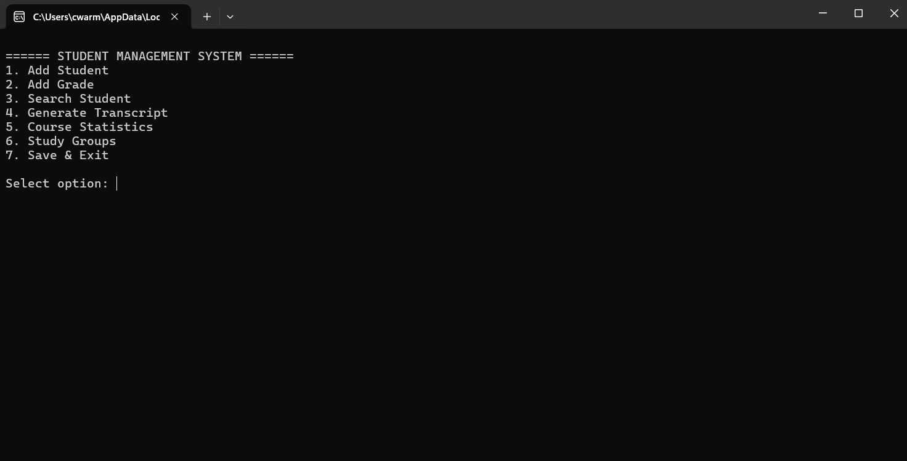
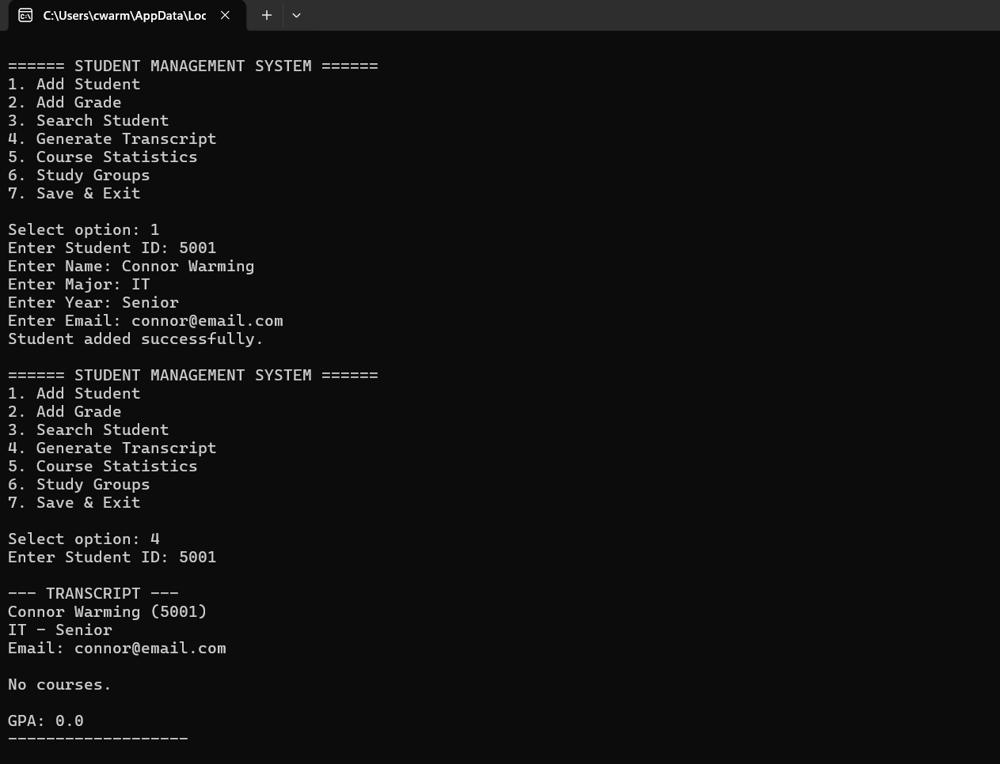

# Student Grade Management System

## Overview
A Python command-line application for managing student records, calculating GPA, and generating transcripts.

## Features
- Add and search students
- Add and update grades
- GPA calculation
- Transcript generation
- JSON data persistence

## Technologies Used
- Python
- JSON

## How to Run
python Student Grade Management System.py

## Screenshots

### Menu

### Transcript Output

## Author
Connor Warming
